# Sistema de Gestão de Produtos

Este projeto é uma solução robusta para o gerenciamento de produtos, desenvolvida como parte de um desafio técnico utilizando o framework **Laravel 11**, **Docker (Laravel Sail)** e **Tailwind CSS**.

## 🚀 Descrição do Projeto
A aplicação consiste em um painel administrativo completo onde usuários autenticados podem gerenciar seu inventário. O foco principal foi a aplicação de boas práticas de arquitetura (**Service Layer**), segurança e testes automatizados.

## ✨ Funcionalidades
* **CRUD Completo**: Cadastro, listagem, edição e exclusão de produtos.
* **Autenticação**: Sistema seguro via Laravel Breeze.
* **API RESTful**: Endpoints JSON protegidos por tokens via Laravel Sanctum.
* **Validação Rigorosa**: Regras para preços positivos, estoque não negativo e nomes únicos.

---

## 🛠️ Pré-requisitos e Ambiente

Para garantir que a aplicação rode sem erros de permissão ou de caminho, siga estas recomendações fundamentais:

1.  **Docker Desktop**: Instalado e em execução.
    * *Importante*: No Windows, vá em **Settings > Resources > WSL Integration** e ative a integração para sua distro (ex: Ubuntu).
2.  **WSL2 (Obrigatório no Windows)**: Execute os comandos **sempre** dentro do terminal Linux.

3.  **Permissões do Docker**: Caso receba erro de `permission denied` ao tentar rodar o Docker no terminal, execute:
    sudo usermod -aG docker $USER && newgrp docker
    

---

##  Instalação e Configuração

Siga os passos abaixo no seu terminal Linux (WSL):

### 1. Clonar o repositório

git clone https://github.com/CatitoReis/gestao-produto.git

### 2. Instalar dependências iniciais (Sem PHP local)

Se você não tem PHP ou Composer instalado diretamente no seu Ubuntu, use este comando para rodar um container temporário que fará a instalação para você:

docker run --rm \
    -u "$(id -u):$(id -g)" \
    -v "$(pwd):/var/www/html" \
    -w /var/www/html \
    laravelsail/php83-composer:latest \
    composer install --ignore-platform-reqs

### 3. Configurar Variáveis de Ambiente

cp .env.example .env (tenha certeza que seu .env está igual ao .env.example)

### 4. Subir os Containers

./vendor/bin/sail up -d

### 5. Finalizar a Preparação do Ambiente
Com os containers rodando, execute os comandos finais de configuração:

 - ./vendor/bin/sail artisan key:generate
 - ./vendor/bin/sail npm install
 - ./vendor/bin/sail npm run build
 - ./vendor/bin/sail artisan migrate --seed

## Execução da aplicação

./vendor/bin/sail npm run dev

## Execução de Testes

Para rodar os testes unitários execute o comando:
./vendor/bin/sail artisan test

## Prints de telas/endpoints
### Autenticação e Início
| Página Inicial | Registro | Login |
| :---: | :---: | :---: |
| 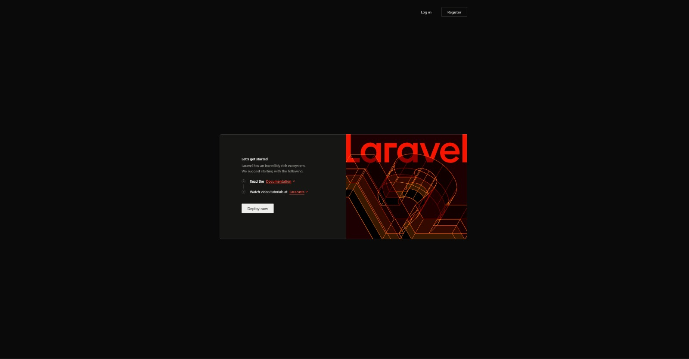 | 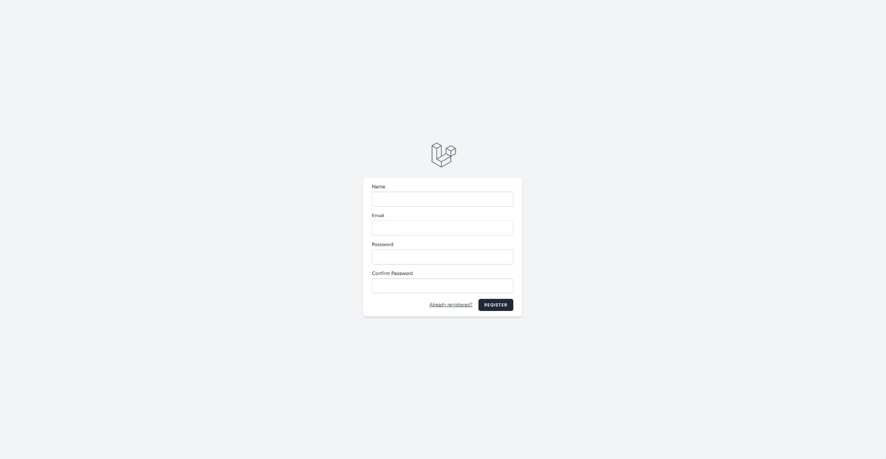 | 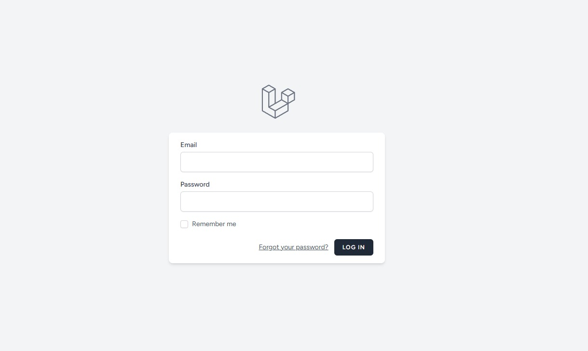 |

### Gestão de Produtos
| Dashboard | Cadastro | Listagem Completa |
| :---: | :---: | :---: |
| 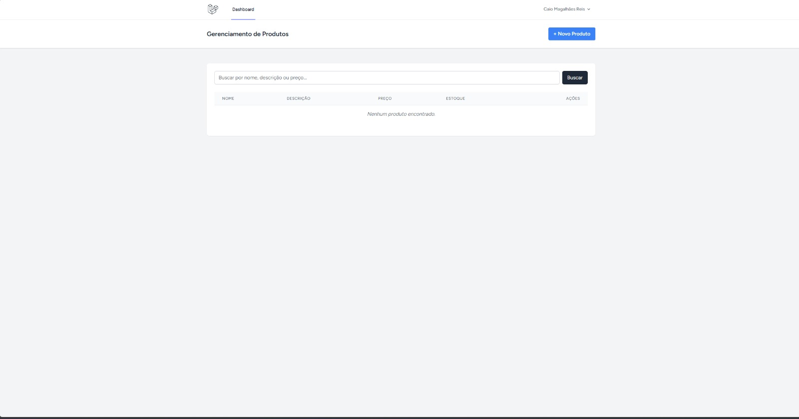 | 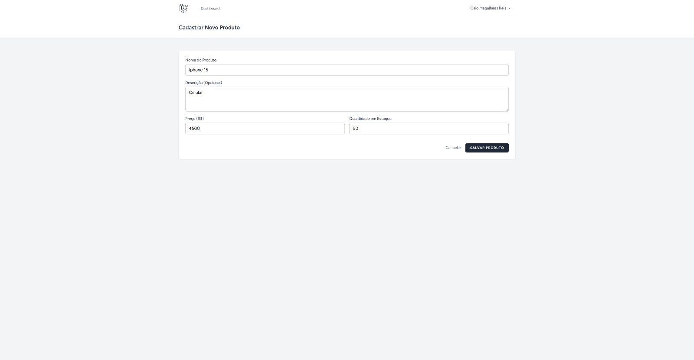 | 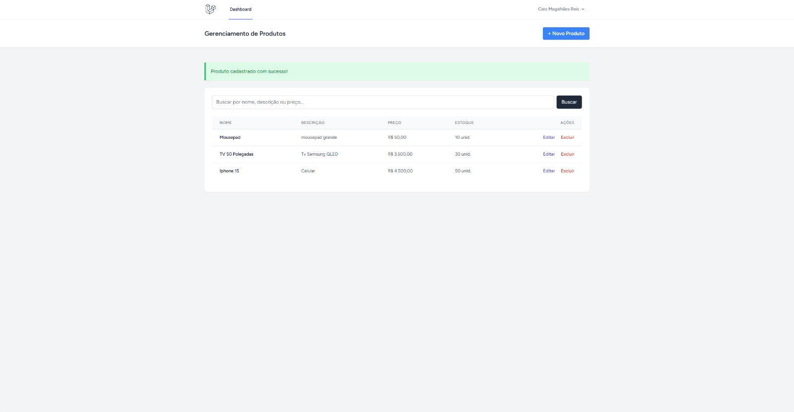 |

### Funcionalidades e Validações
| Erro Valor Negativo | Edição de Produto | Produto Removido |
| :---: | :---: | :---: |
| 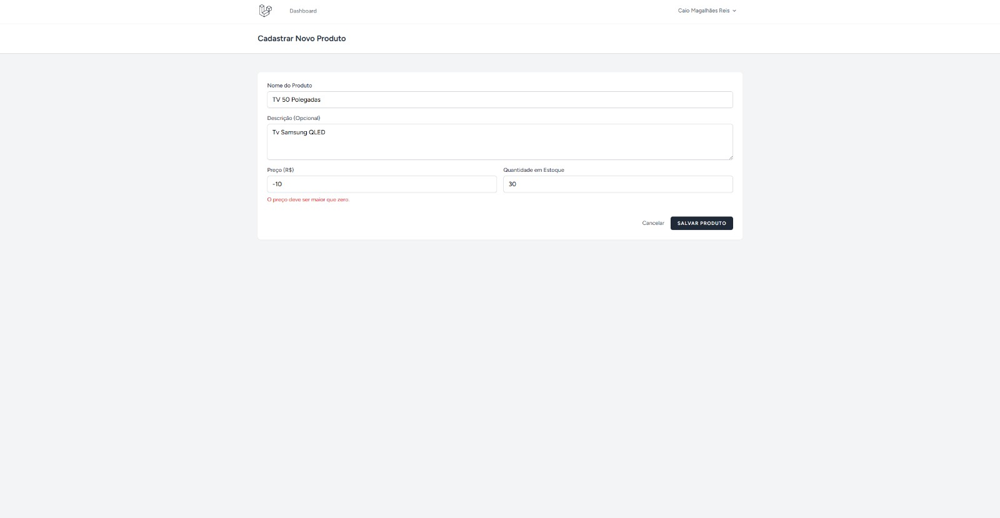 | 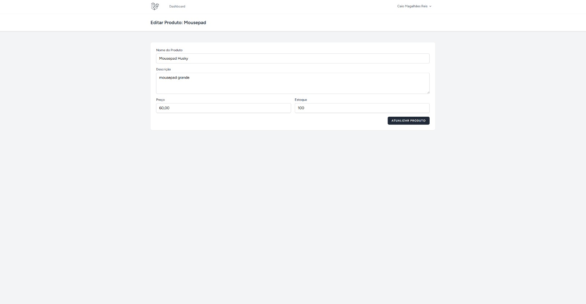 | 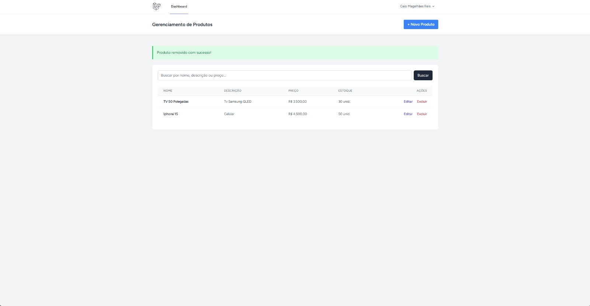 |

### Filtros de Pesquisa
| Por Nome | Por Descrição | Por Preço |
| :---: | :---: | :---: |
| 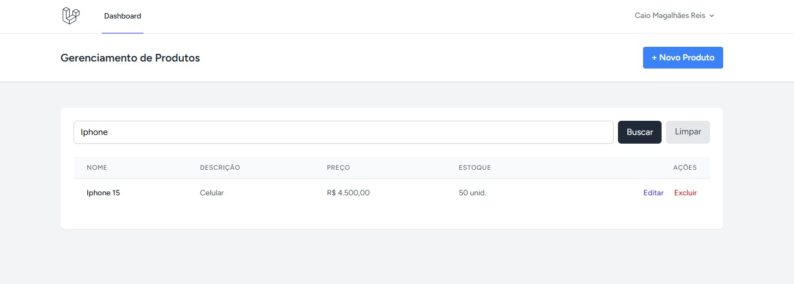 | 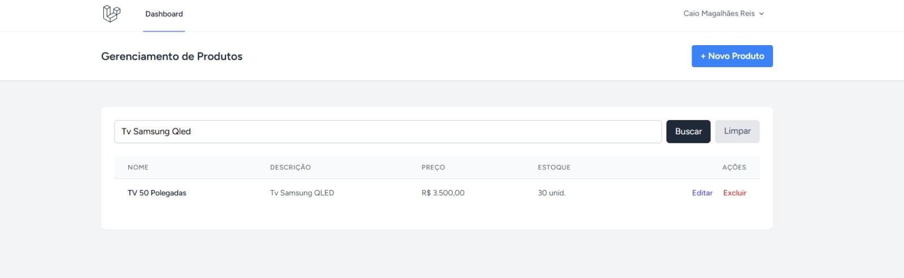 | 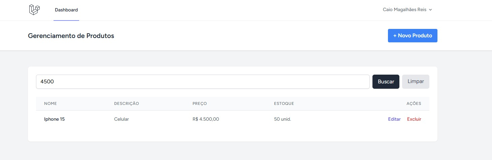 |

